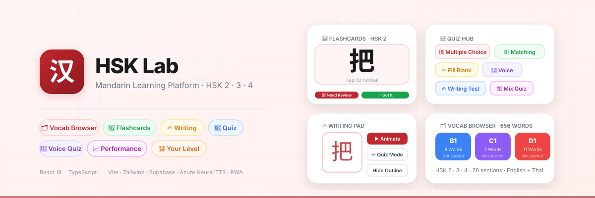

<div align="center">



<br/>

[](https://react.dev)
[](https://typescriptlang.org)
[](https://vitejs.dev)
[](https://tailwindcss.com)
[](https://supabase.com)
[](https://web.dev/progressive-web-apps)
[](https://hsk-app-fawn.vercel.app)

**[🌐 Live Demo](https://hsk-app-fawn.vercel.app)**  ·  中文 / English / ภาษาไทย

</div>

---

## What is HSK Lab?

Interactive Mandarin learning PWA for HSK 2–4 students.
Dual translations **English + Thai**. Works offline. Installable on any device.

---

## Features

| Module | Description |
|--------|-------------|
| 🗂️ **Vocab Browser** | Browse 656 words by category or HSK level. Track mastery per section. |
| 🎴 **Flashcards** | Section-based and random study modes. Category deck support. |
| ✍️ **Writing** | Guided stroke-order practice (HanziWriter) + free-draw canvas. |
| 🧩 **Quiz Hub** | Multiple Choice, Fill-in-Blank, Matching, Voice, Writing, Mix modes. |
| 📈 **Performance** | Study streaks, quiz history, weak word analysis, session analytics. |
| 🎯 **Your Level** | Diagnostic pre-test to recommend HSK 2 / 3 / 4 starting level. |

---

## Tech Stack

- **Frontend**: React 18 + TypeScript + Vite
- **Styling**: Tailwind CSS
- **Chinese writing**: HanziWriter
- **TTS**: Azure Cognitive Services Neural TTS (`zh-CN-XiaoxiaoNeural`) with Web Speech API fallback
- **Backend / DB**: Supabase (feedback collection, pronunciation history, progress sync)
- **PWA**: vite-plugin-pwa + Workbox (offline-capable, installable)
- **Deploy**: Vercel

---

## Local Setup

```bash
git clone https://github.com/phaixiaobai/hsk-learning-lab.git
cd hsk-learning-lab
npm install
cp .env.example .env   # fill in your keys
npm run dev            # http://localhost:5173
```

---

## Environment Variables

Create `.env` from `.env.example`:

```env
# Supabase (optional — app works without it, feedback/sync disabled)
VITE_SUPABASE_URL=https://your-project.supabase.co
VITE_SUPABASE_ANON_KEY=your-anon-key

# Azure Neural TTS (optional — falls back to browser TTS if not set)
# Free tier: 500,000 characters/month
# Setup: portal.azure.com → Create Speech resource (F0 free tier)
VITE_AZURE_SPEECH_KEY=your-azure-speech-key
VITE_AZURE_SPEECH_REGION=eastasia
```

Both are optional — app runs fully client-side without them.

---

## Database Setup (Supabase)

Run in Supabase SQL Editor **in order**:

```
supabase/schema.sql           # core tables
supabase/feedback-schema.sql  # feedback tables
```

---

## Project Structure

```
src/
├── App.tsx                     # Tab routing, level/language state
├── modules/
│   ├── VocabBrowser.tsx        # Vocabulary browser + progress tracker
│   ├── Flashcards.tsx          # Flashcard study module
│   ├── WritingPad.tsx          # HanziWriter stroke practice
│   ├── Analytics.tsx           # Performance dashboard
│   ├── LevelEval.tsx           # HSK level diagnostic
│   ├── Admin.tsx               # Feedback admin (?admin=1)
│   └── quiz/
│       ├── QuizHub.tsx         # Quiz mode selector
│       ├── QuizRunner.tsx      # Session orchestrator
│       ├── QuizResult.tsx      # Results + feedback form
│       └── modes/              # MultipleChoice, FillBlank, Matching, Voice, Writing
├── hooks/
│   ├── useSpeechSynthesis.ts   # Azure Neural TTS + Web Speech fallback
│   ├── useSpeechRecognition.ts # Voice quiz microphone
│   ├── useVocabProgress.ts     # Category chunk progress
│   └── useLocalStorage.ts      # Persistent useState
├── utils/
│   ├── quizGenerator.ts        # Dynamic quiz question builder
│   ├── voiceScoring.ts         # Tone-aware pronunciation scoring
│   └── sections.ts             # Pinyin-initial section grouping
├── lib/
│   ├── supabase.ts             # Supabase REST client
│   └── session.ts              # Anonymous session ID
└── data/
    └── vocabulary.json         # 656 words, HSK 2/3/4, with example sentences
```

---

## Admin Dashboard

Access: append `?admin=1` to any URL → go to **Performance** tab.

Shows aggregated feedback:
- Voice score accuracy per word
- Flagged fill-blank sentences
- Words users find difficult
- Post-quiz ratings and comments

Requires Supabase + `feedback-schema.sql` applied.

---

## Install as PWA

1. Open live URL in **Safari** (iOS) or **Chrome** (Android/Desktop)
2. Share → **Add to Home Screen**
3. Launches full-screen, works offline after first visit

---

## License

MIT
